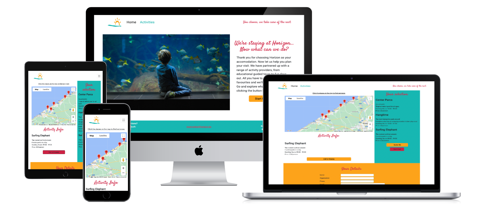
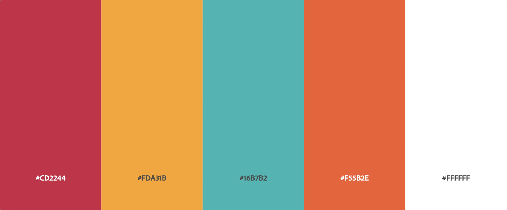
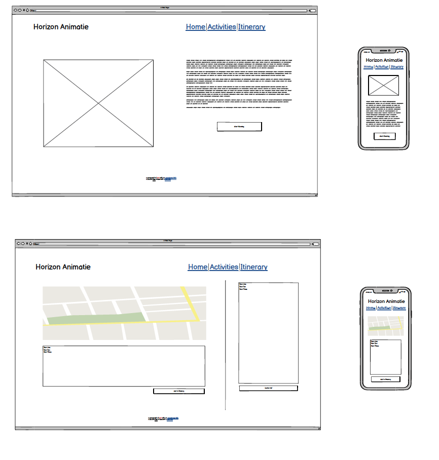

# Horizon Activity Booking Website

This website offers visitors an overview of possible activities in the area of a holiday accomodation provider (Horizon).
An online place where visitors can browse activities based on location on a map, get more info and request a quote from the provider.

 

## User Experience
---

### _User Stories_

- #### **First Time Visitor Goals:**
1. As a first time user, I want to find out the purpose of the website immediately.
2. As a first time user, I want to find clear navigation to all parts of the website.
3. As a first time user, I want to find out what activities are available.

- #### **Returning Visitor Goals:**
1. As a returning user, I want to find out how I can book the activities.
2. As a returning user, I want to find out how to get in touch if I have further questions.

- #### **Frequent User Goals:**
1. As a frequent user, I want to find out if there are any new activities.

### _Design_

- #### **Colour Scheme**

     
    Colour scheme based on Horizon logo. It has been tested to be accessible to color blind users. Made with [Adobe Color](https://color.adobe.com/).

- #### **Typography**

    <strong>Headings:</strong> Satisfy, [Google Fonts](https://fonts.google.com/). A bit playful and fun to match the fun activities. 
    <strong>Main font:</strong> Roboto, [Google Fonts](https://fonts.google.com/). Clear, legible without being too formal looking.

- #### **Wireframes**

     

    Wireframes for homepage and activities page.
    Made with [Balsamiq](https://balsamiq.com/).

    During the developing process a few changes were made to the lay-out to improve user experience and javascript coding.

## Features
---

### _Existing Features_

- __Interactive Google Map__

    Users can select activities based on locations on a Google Map.
    They simply have to click on the marker to get more info.
    The user can decide to add them to their selection.
    They can also choose to start over if they made a wrong selection.

- __Quote Request Form__

    After the user has made a selection of activities, they can request a quote.
    The form will collect important information for the site owner who needs to book the activities.
    The form also collects the user's selection in a hidden input field.
    All the information from the form will be emailed to the site owner when the 'Get A Quote' button is clicked.

### _Features Left To Implement_

- __New Activities__

    A way of showing which activity has been added recently

- __Home Icon__

    Instead of a marker, Horizon's own location could be marked with a little icon (a house or logo).

## Technologies Used
---

### _Languages Used_

-   [HTML5](https://en.wikipedia.org/wiki/HTML5)
-   [CSS3](https://en.wikipedia.org/wiki/Cascading_Style_Sheets)
-   [Javascript](https://en.wikipedia.org/wiki/JavaScript)
-   [jQuery](https://en.wikipedia.org/wiki/JQuery)

### _Frameworks, Libraries & Programs Used_

1. [Google Cloud Platform](https://console.cloud.google.com/)
1. [Google Maps Javascript API](https://console.cloud.google.com/)
1. [EmailJS](https://www.emailjs.com)
    - Sending form data to email address
1. [Bootstrap:](https://getbootstrap.com/docs/5.1/getting-started/introduction/)
    - Bootstrap was used on parts of the website to make them responsive.
1. [Adobe Color:](https://color.adobe.com/)
    - Adobe Color was used to select the colour scheme and test its accessibility.
1. [Balsamiq:](https://balsamiq.com/)
    - Balsamiq was used to create the wireframes during the design process.
1. [Gitpod:](https://gitpod.io/workspaces)
    - Gitpod workspaces was used to create and edit code and push them onto the Github repo.
1. [GitHub:](https://github.com/)
    - GitHub is used to store the projects code after being pushed from the Gitpod.
1. [Hover.css:](https://ianlunn.github.io/Hover/)
    - Hover.css was used on the Social Media icons in the footer to add the float transition while being hovered over.
1. [Google Fonts:](https://fonts.google.com/)
    - Google fonts was used to import the 'Montserrat' and 'Nothing You Could Do' (logo) fonts into the style.css file which are used on all pages.

## Testing 
---

- [HTML](https://jigsaw.w3.org/css-validator/#validate_by_input)
- [CSS](https://jigsaw.w3.org/css-validator/validator)
- [JSLint](https://www.jslint.com/)

### _Validator Testing_

- #### **HTML**

    - Error: stray tags

- #### **CSS**

    - Error: black is not hex code (changed)
    - type: javascript is unnecessary in script tag (kept)

- #### **JSLint**

    - Several warnings regarding order of properties, but kept for code readability.
    - Unexpected trailing spaces
    - Warning of unexpected for and let in for loop coding.

### _Testing User Stories from User Experience (UX) Section_

- #### **First Time Visitor Goals:**
1. As a first time user, I want to find out the purpose of the website immediately.
    - The logo, hero image and text clearly state the purpose on home page.
2. As a first time user, I want to find clear navigation to all parts of the website.
    - The navigation is clear, simple and immediately visible on top of the page, there is no distraction by background.
3. As a first time user, I want to find out what activities are available.
    - Only one click needed to get to activity overview on map.

- #### **Returning Visitor Goals:**
1. As a returning user,  I want to find out how I can book the activities.
    - Once on activity page, the call to action buttons are clearly visible.
2. As a returning user, I want to find out how to get in touch if I have further questions.
    - As well as the form on the activity quote page, the contact details are in the footer of the website.

- #### **Frequent User Goals:**
1. As a frequent user, I want to find out if there are any new activities.
    - Markers could change colour if they are new (still to implement).

## Deployment
---
This project was developed on Gitpod, committed to Git and pushed onto the [Github repository](https://github.com/StienBoodts/horizon-animatie-CI-MP2) using Bash. 

To deploy the website from the repository onto Github Pages the following steps were taken:

1. log into Github
2. from the list of repositories, choose **StienBoodts/horizon-animatie-CI-MP2**.
3. Navigate to **Settings** at the top of the repository.
4. Choose **Pages** from the menu on the left of the page.
5. In the Source Section, select **Branch: main** in the drop down menu.
6. Leave **/(root)** selected in the next drop down menu.
7. Press **Save**
8. The page will refresh and the **link to the deployed website** will appear at the top.

## Credits & Resources
---

### _Content_ 

1. [Developers.google.com](https://developers.google.com/maps/documentation/javascript/overview)
    - Google Maps Javascript API documentation
1. [EmailJS](https://www.emailjs.com)
    - Tutorials to set new parameters
1. [Code Institute](https://codeinstitute.net/)
    - general info and practice of HTML, CSS & UX lessons and mini projects taken as reference for the creation of this website.
1. [https://stackoverflow.com/](https://stackoverflow.com/)
    - General searches to solve issues
1. [MDN Web Docs](https://developer.mozilla.org/)
    - Gnereal Reference
1. [Github Docs](https://docs.github.com/en/get-started/writing-on-github/getting-started-with-writing-and-formatting-on-github/basic-writing-and-formatting-syntax)
    - Github Markdown Cheat Sheet

### _Media_

1. [Unsplash](https://unsplash.com/photos/KjFBdofUjco)
    - Front Page hero image

